# Phoenix LiveView

A Solution to Madness - Joshua Plicque

<!--
* Hello, I'm Joshua Plicque

* I've been working with Phoenix LiveView for a little under a year now

* Chris McCord made a lot of bold statements. I'm here to tell you that it's true
-->
---

## What We'll Cover

- What is Phoenix LiveView and what does it promise?
- How LiveView Works
- Phoenix LiveView Programming Model - Thinking in LiveView
- Using Phoenix Contexts to reuse code and quickly spin up API's
- Writing Tests - And why it's blissful
- Coding with alpha software

<!--
* Promise - dynamic web applications without Javascript

* We'll walk through 4 real-world features that I've built in LiveView, bolting on increasing complexity

* We'll take a brief look at the testing infrastructure and syntax. My entire application's test suite takes less than 10 seconds. My entire application's test suite takes less than 4 seconds.

* And I hired someone who knew only a little bit of Python and he's shipping Elixir and LiveView code daily
-->
---

 
 
 
 
 
 

- I run a small web development shop
- Developing Software Professionally for 7 years
- Been using LiveView full-time for just under a year

---

> Phoenix LiveView is an exciting new library which enables rich, real-time user experiences with server-rendered HTML. LiveView powered applications are stateful on the server with bidirectional communication via WebSockets, offering a vastly simplified programming model compared to JavaScript alternatives.

 
Chris McCord

---

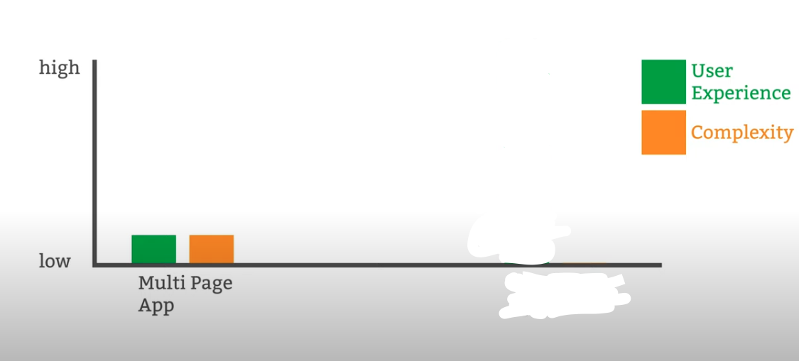

---

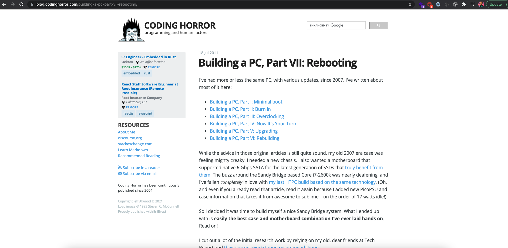

---

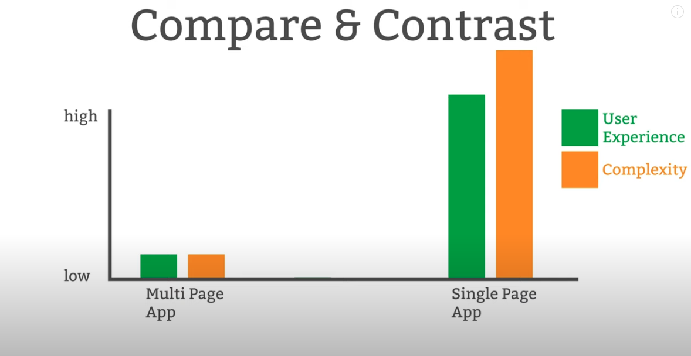

---

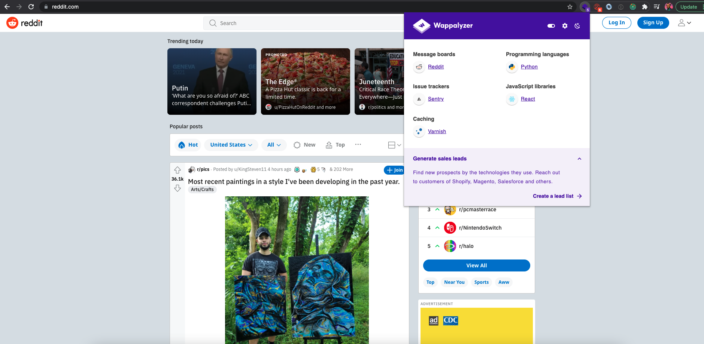
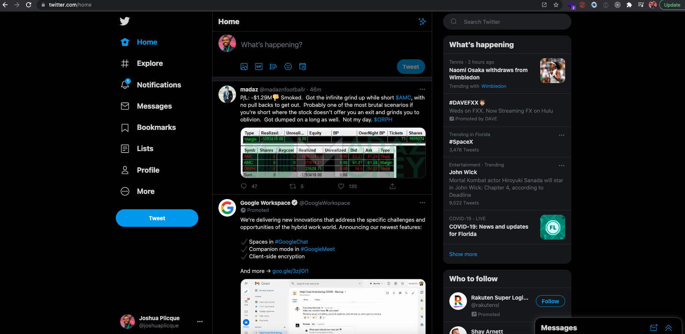
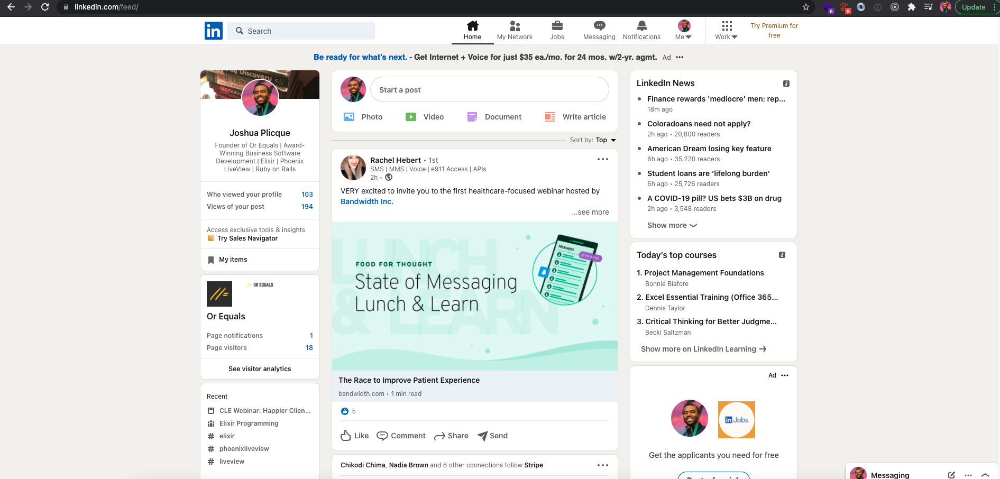
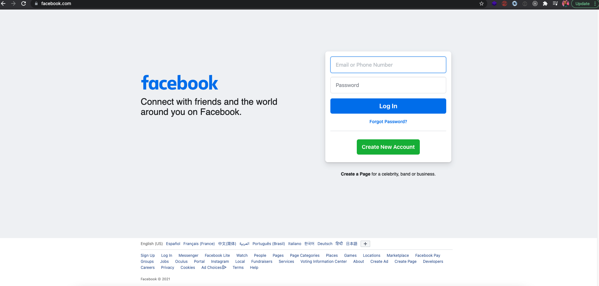

---

The people demand better

---

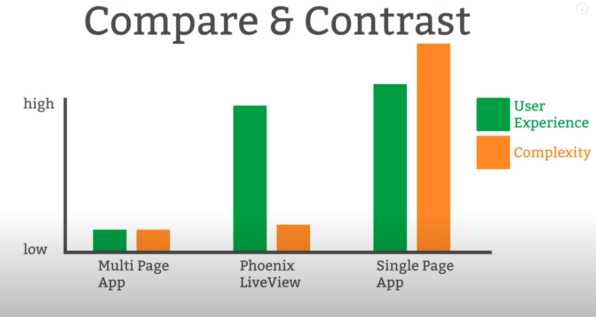

---

# The LiveView Promise

Get blackout drunk with no chaser.

---

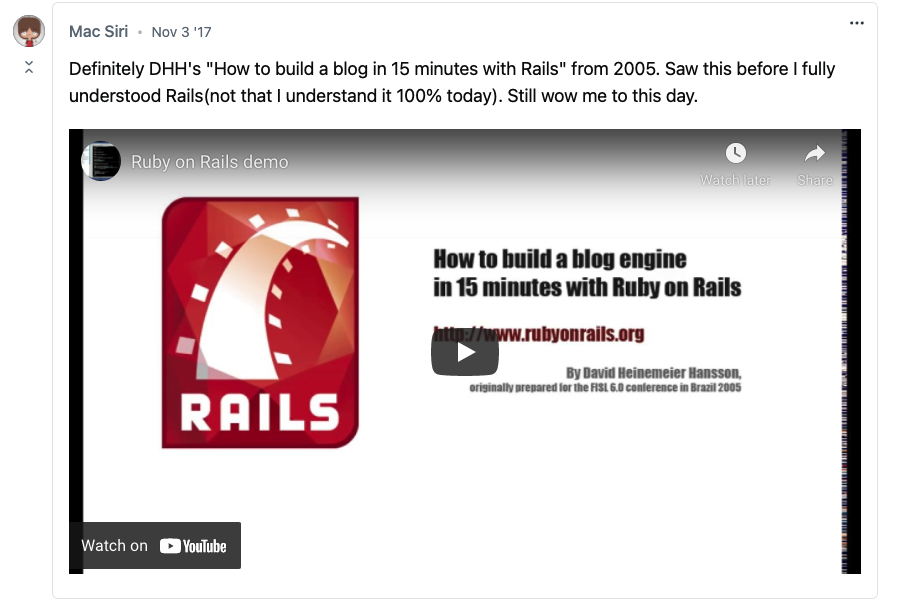

---

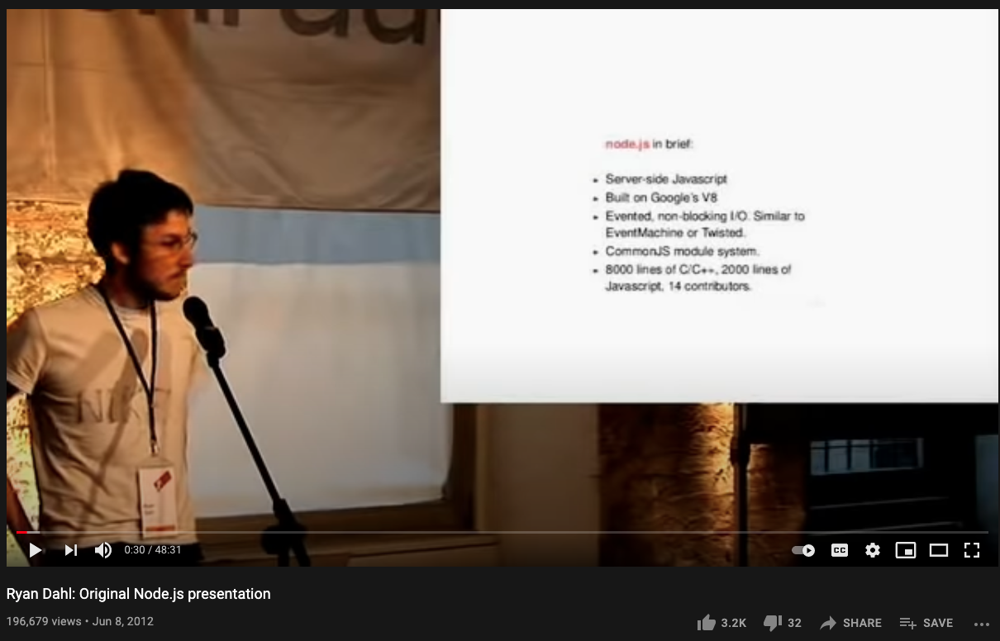

---

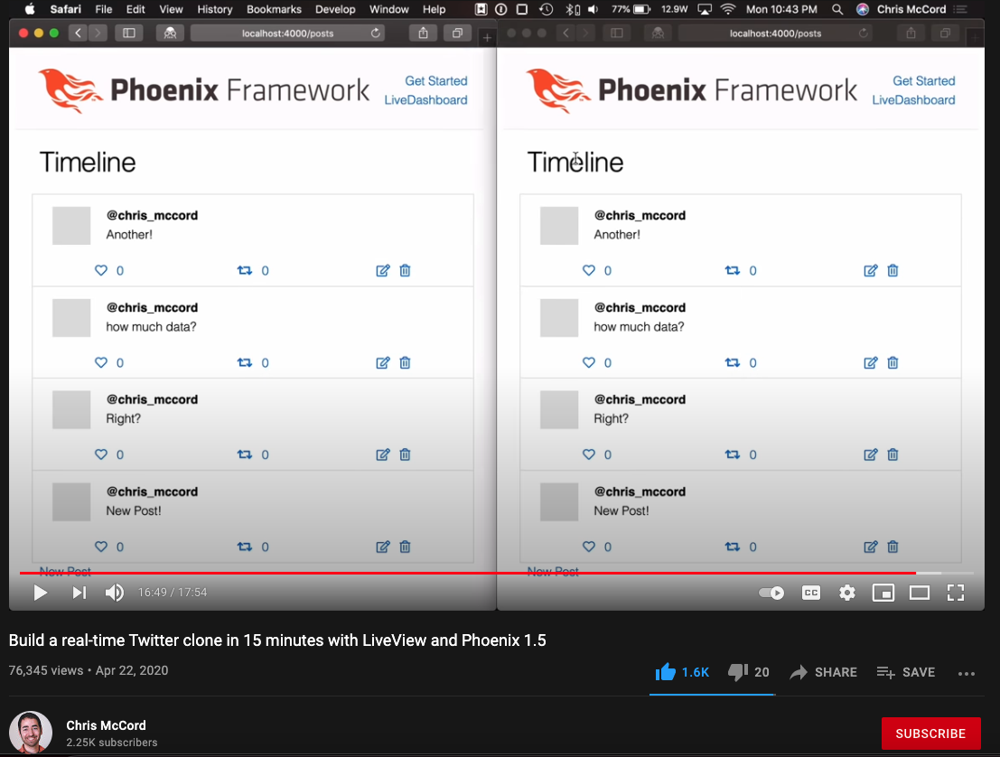

---

# Big
# Cojones

---

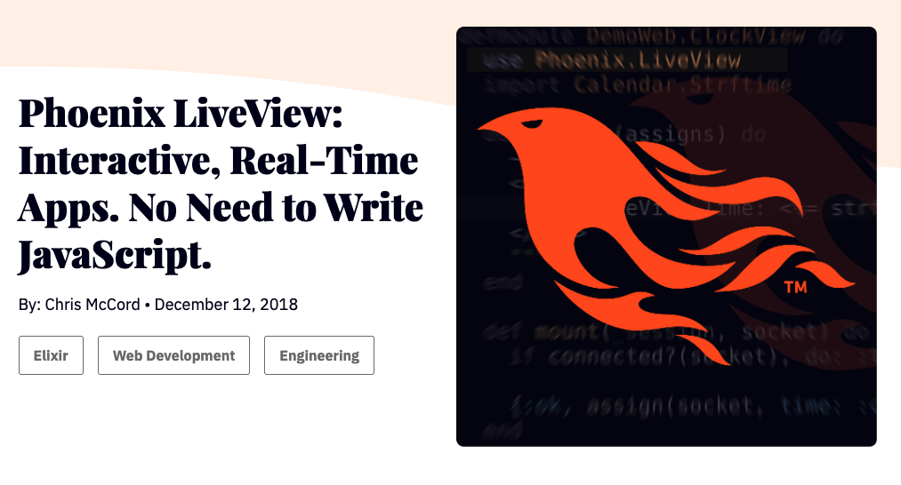

---

---

# How does LiveView work?

---

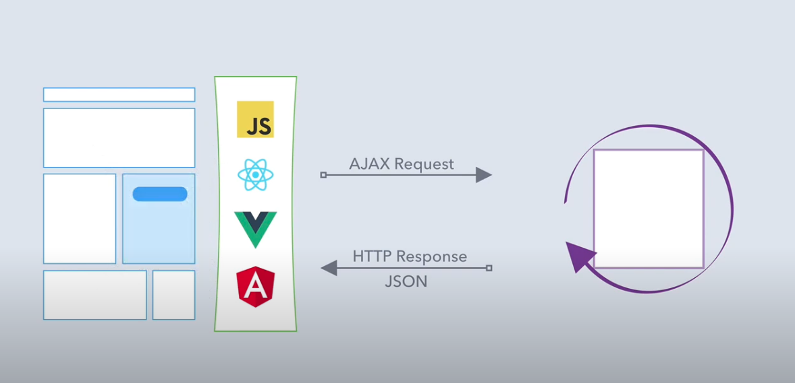

---

# How does LiveView work?
1. Endpoint
2. Router
3. Initial Mount
    1. Mount (HTML and Websocket)
    3. `handle_params`()
    4. `render()`
4. Responding to Events
    1. `handle_event()`
    2. `render()`
---

# Grossly Overengineered Church Website Demo

<!--
Contacts feature
-->
---

# Thinking in Model-View-Controller

1. Endpoint
2. Router
3. Controller
    1. Loads data from schema
    2. Supplies data to the view
4. View
5. Template

---

# Thinking in LiveView

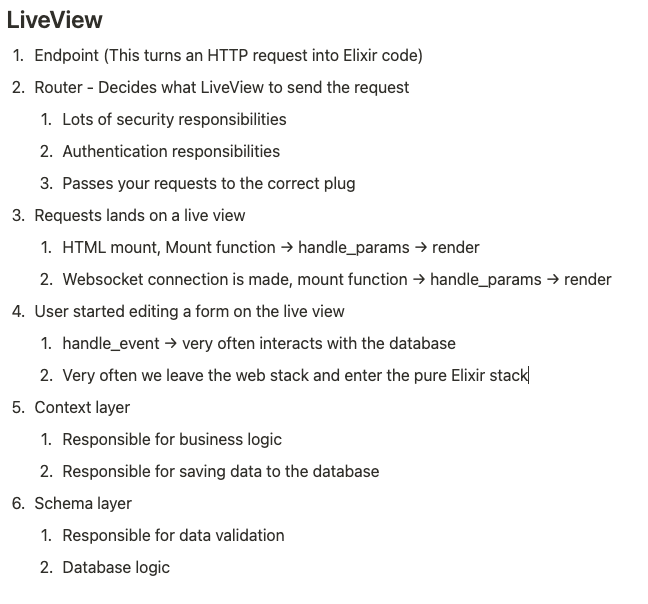

---

# Thinking Demo - Banner Uploads

1. Endpoint
---

# Thinking Demo - Banner Uploads

2. Router

---

# Thinking Demo - Banner Uploads

3. Initial Load

---

# Thinking Demo - Banner Uploads

4. Responding to Events

---

# Thinking Demo - Banner Uploads

5. The Context Layer

---

# Thinking Demo - Banner Uploads

6. The Schema Layer

---

Pretty sweet right?

---

Sounds cool. But you're just a lowly CRUD app developer

---

BUT WAIT, THERE'S MORE

---

# Quickly Exposing APIs

You can leverage Phoenix's Context layer standard architecture to quickly bolt on API's

---

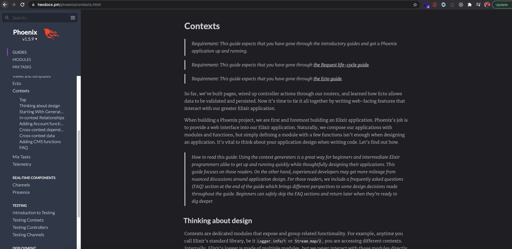

---

Let's go back to church. API goodness

---

# Also, testing is lightning fast

---

# LiveView Version 0.15.x????

---

The documentation is best-in-class. Premium. Free. Just read the docs. It's ALL THERE!!!

---

# Shill

---

# ???

---
